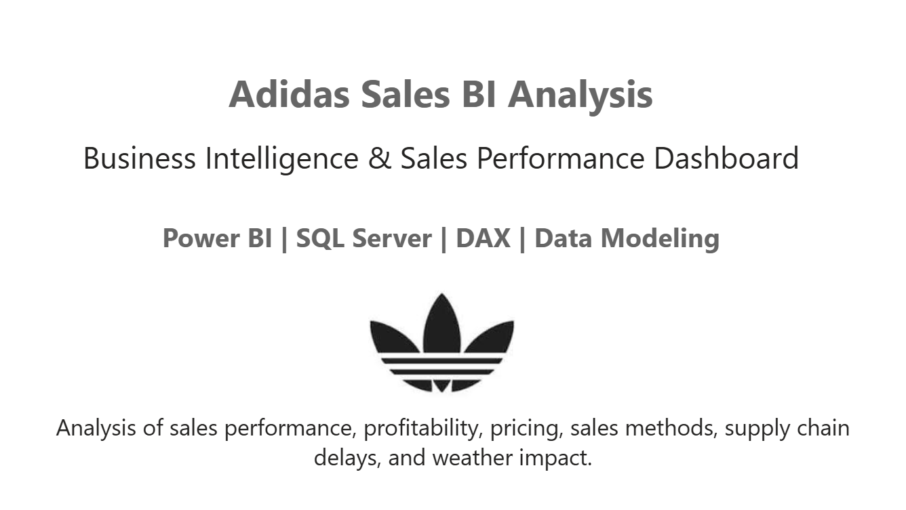
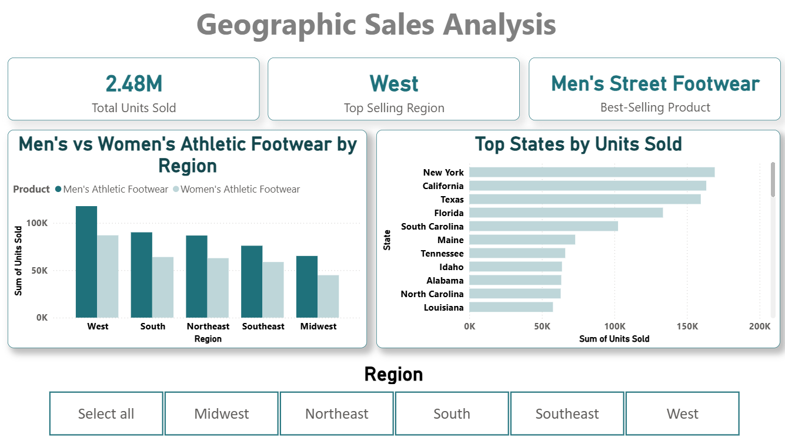
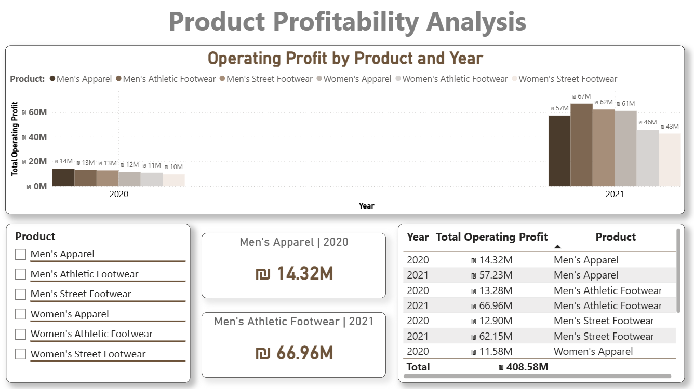
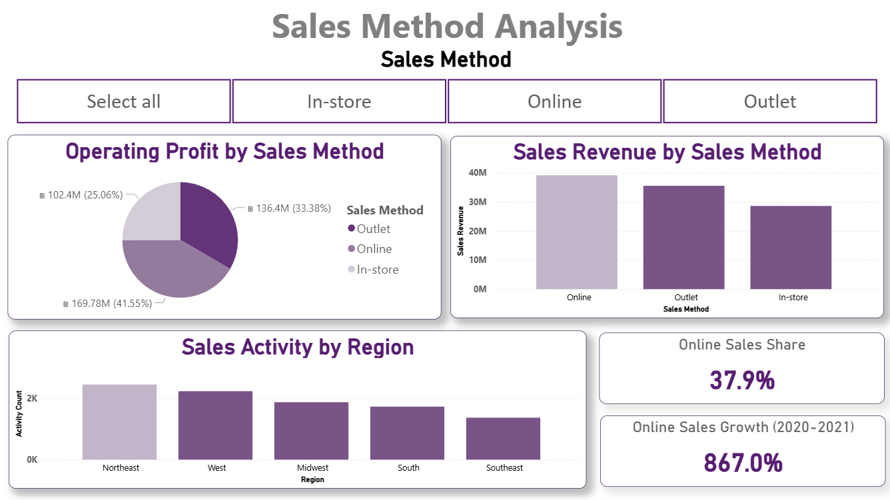
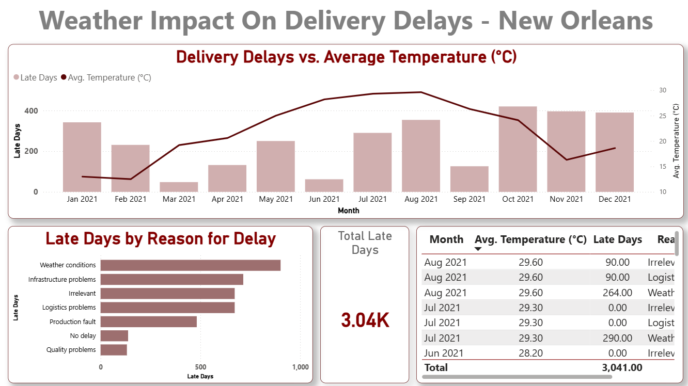

# Adidas Sales BI Analysis

Business Intelligence project analyzing Adidas U.S. sales data using Power BI, SQL Server, DAX, and data modeling.

## Project Overview

This academic BI project focuses on preparing, modeling, and analyzing Adidas sales data to identify business trends and performance insights.

SQL Server was used for data preparation and modeling, including Fact and Dimension structures and ETL transformations.

Power BI and DAX were used to build an interactive multi-page dashboard covering sales performance, profitability, pricing, sales methods, supply chain delays, and weather-related delivery analysis.

## Tools \& Technologies

- Power BI

- DAX

- SQL Server

- Excel

- Data Modeling

- ETL

## Dashboard Analysis

The dashboard includes:

- Geographic Sales Analysis

- Profit Analysis

- Supply Chain Delay Analysis

- Price \& Sales Analysis

- Product Profitability Analysis

- Sales Method Analysis

- Weather Impact Analysis for New Orleans

## Key Highlights

- Identified the highest-performing sales regions and products.

- Compared operating profit across states, products, and years.

- Analyzed product pricing in relation to units sold.

- Examined sales performance across Online, Outlet, and In-store channels.

- Analyzed supply chain delays by city and reason.

- Integrated weather data to examine delivery delays in New Orleans.

## Dashboard Preview

### Geographic Sales Analysis

### Product Profitability Analysis

### Sales Method Analysis

### Weather Impact Analysis

## Project Structure

- `dashboard/` – Power BI dashboard file

- `data/` – Source dataset

- `sql/` – SQL scripts used for data preparation and modeling

- `dax/` – DAX code used in the Power BI model

- `assets/` – Dashboard screenshots

## Author

Shir Yitzhak

